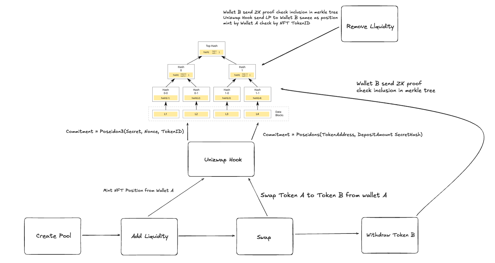

# Unizwap: Privacy-Preserving DEX Protocol

> 🏆 Privacy-native decentralized exchange built on Uniswap V4 Hooks with zero-knowledge proofs

## 📑 Table of Contents

- [Project Overview](#-project-overview)
- [Demo & Links](#-demo--links)
- [Proof of Functional Code](#-proof-of-functional-code-transaction-evidence)
  - [Deployed Contracts on Sepolia](#-deployed-contracts-on-sepolia-testnet)
  - [Real Transaction on Sepolia Testnet](#real-transaction-on-sepolia-testnet)
  - [How to Verify Functionality](#-how-to-verify-functionality)
- [Key Features](#-key-features)
- [Why Private DEX](#why-private-dex)
- [Core Challenges](#core-challenges)
- [Core Ideas on How Unizwap Works](#core-ideas-on-how-unizwap-works)
- [Architecture](#️-architecture)
- [How It Works](#-how-it-works)
- [Privacy Analysis](#-privacy-analysis-important)
- [Smart Contracts](#-smart-contracts)
- [ZK Design](#-zk-design)
- [Technical Innovations](#-technical-innovations)
- [Developer Guide](#-developer-guide)
- [Usage Guide](#-usage-guide)
- [Security Considerations](#-security-considerations)
- [Limitations](#️-limitations)
- [Future Work / Roadmap](#-future-work--roadmap)
- [Contract Deployment & Usage](#-contract-deployment--usage)
- [Additional Resources](#-additional-resources)
- [Advanced Usage](#-advanced-usage)
- [External Resources](#-external-resources)
- [License](#-license)

## 🎯 Project Overview

**Unizwap** is a privacy-preserving decentralized exchange (DEX) protocol that brings privacy to Uniswap V4 through hooks and zero-knowledge proofs. It enables users to perform all core DeFi operations—swap, add liquidity, remove liquidity, and withdraw—while maintaining privacy through commitment-based schemes and ZK proof verification.

### One-Paragraph Pitch

Unizwap makes DeFi private by default. Built on Uniswap V4 Hooks, it uses zero-knowledge proofs to enable private swaps, private liquidity provision, and cross-wallet withdrawals—all without trusted intermediaries or sequencers. Users deposit with one wallet, swap privately, and withdraw with another wallet using ZK proofs, breaking on-chain linkability while maintaining full Uniswap V4 compatibility.

### The Problem

**Trading and Liquidity is HUGE**
- Uniswap V3 handles billions in daily trading volume
- Liquidity provision and swapping are core financial primitives in DeFi

**But Everything is PUBLIC**
- On Ethereum L1, your full position is exposed:
  - How much you swapped or provided as liquidity
  - Which token pairs and amounts
  - Your complete trading history and wallet balance
  - MEV bots can frontrun trades and extract value

### Our Solution

Unizwap solves DeFi privacy through **hook-native architecture**:
- ✅ **No trusted hardware**: Pure smart contract and ZK proof verification
- ✅ **No sequencers**: Direct execution on Ethereum using Uniswap V4 hooks
- ✅ **No shared state limitations**: Individual position privacy with commitment schemes
- ✅ **Full compatibility**: Native Uniswap V4 pools and liquidity

### Why Now

1. **Uniswap V4 Hooks**: First time we can extend DEX behavior natively
2. **Efficient ZK Proofs**: Circom + Groth16 enables practical on-chain verification
3. **Privacy Demand**: Users need protection from MEV, frontrunning, and surveillance
4. **No Trust Required**: Pure smart contract solution without TEEs or centralized coordinators

## 🎬 Demo & Links

### Live Demo
- **Frontend**: [https://unizwap-ktkl.vercel.app](https://unizwap-ktkl.vercel.app)
- **Sepolia Testnet**: Fully deployed and operational

### Resources
- **Video Demo**: _[Add link]_
- **Pitch Deck**: _[Add link]_
- **Documentation**: See sections below

## 🔗 Proof of Functional Code (Transaction Evidence)

### ✅ Deployed Contracts on Sepolia Testnet

| Contract | Address |
|----------|---------|
| **UnizwapHook** | [`0x33a0529f481140fdc2d14a47d2ce8f2b9d1e4ac4`](https://sepolia.etherscan.io/address/0x33a0529f481140fdc2d14a47d2ce8f2b9d1e4ac4) |
| **SwapWithdrawVerifier** | [`0x548a65DbF4B2278B073544ee62cc5735a43eDE8F`](https://sepolia.etherscan.io/address/0x548a65DbF4B2278B073544ee62cc5735a43eDE8F) |
| **RemoveLqVerifier** | [`0xD8cD6542b557dE6C78Cf29Ae94639265D0e83160`](https://sepolia.etherscan.io/address/0xD8cD6542b557dE6C78Cf29Ae94639265D0e83160) |

### Real Transaction on Sepolia Testnet

| Operation | Transaction Hash | Status |
|-----------|------------------|--------|
| **Hook Deployment** | [`0x9328efafcdd955e162fbd04b59564a5f4ff72989ec7cab0df6302fcaef68924e`](https://sepolia.etherscan.io/tx/0x9328efafcdd955e162fbd04b59564a5f4ff72989ec7cab0df6302fcaef68924e) | ✅ Verified |
| **Create Pool** | [`0x5c0b33e9ca397147cc9ad0b02663cdd9f770699c981b877fa35fe24bbb91cdfa`](https://sepolia.etherscan.io/tx/0x5c0b33e9ca397147cc9ad0b02663cdd9f770699c981b877fa35fe24bbb91cdfa) | ✅ Success |
| **Add Liquidity (with Commitment)** | [`0xa30686b8a486f467fde247cd229ed3c00471267a6af5a8fd8c52cca895eb05f1`](https://sepolia.etherscan.io/tx/0xa30686b8a486f467fde247cd229ed3c00471267a6af5a8fd8c52cca895eb05f1) | ✅ Success |
| **Swap with Privacy (Router)** | [`0x14c6dd86b64051a1262f4b17822247bb8899756ad07f98dbd909afa2f9a5da0a`](https://sepolia.etherscan.io/tx/0x14c6dd86b64051a1262f4b17822247bb8899756ad07f98dbd909afa2f9a5da0a) | ✅ Success |
| **Private Withdrawal (ZK Proof)** | [`0xf45aa47479a884b2ff070b1f79b4a4e75bf0ec29af7fbd4fbd678d56c89a704b`](https://sepolia.etherscan.io/tx/0xf45aa47479a884b2ff070b1f79b4a4e75bf0ec29af7fbd4fbd678d56c89a704b) | ✅ Success |
| **Remove Liquidity (ZK Proof)** | [`0x49ccb4ed3897875285a23d6a996a7919a2e880ccbc5e5e5abcbb090b05f41a83`](https://sepolia.etherscan.io/tx/0x49ccb4ed3897875285a23d6a996a7919a2e880ccbc5e5e5abcbb090b05f41a83) | ✅ Success |

**Deployment Details:**
- Block: 10213335
- Gas Used: 3,984,201
- Optimizer Runs: 200 (optimized for deployment size)

> **Note**: Run the complete flow using `shortcut/unizwap-hook/` scripts to generate these transaction IDs. Each operation can be independently verified on Etherscan.

### 🧪 How to Verify Functionality

1. **View Contract Code**: Click any contract address above → "Contract" tab → "Read/Write Contract"
2. **Check Transactions**: Click any TxID above → See input data, logs, and state changes
3. **Run Scripts Yourself**: 
   ```bash
   cd contract/shortcut
   npx tsx 00_CreatePool.ts      # Creates pool
   npx tsx 01_AddLiquidity.ts    # Adds LP with commitment
   npx tsx 02_SwapRouter.ts      # Executes swap with commitment
   npx tsx 03_WithdrawRouter.ts  # Withdraws with ZK proof
   npx tsx 03_WithdrawRouter.ts  # Remove LP with ZK proof
   ```

All operations are **fully on-chain** and can be verified on Sepolia Etherscan. No trusted components required.

## ✨ Key Features

### 🔒 Private Swaps
- Output tokens stored by commitment, not wallet address
- Merkle tree insertion for privacy
- ZK proof required for withdrawal
- Break linkability between deposit and withdrawal wallets

### 💧 Private Liquidity
- LP positions tracked by commitments, not addresses
- NFT ownership held by hook contract
- ZK proof required to prove position ownership
- Remove liquidity to any wallet with valid proof

### 🎭 ZK Withdrawal
- Cross-wallet withdrawals using zero-knowledge proofs
- Nullifier prevents double-spending
- Merkle inclusion proof verifies commitment validity
- No on-chain link between original depositor and recipient

### 🎣 Hook-Based Execution
- Native Uniswap V4 hook integration
- beforeSwap/afterSwap for swap privacy
- beforeAddLiquidity for LP commitment insertion
- beforeRemoveLiquidity for ZK proof verification

### 🏦 Router Architecture
- Direct execution through Uniswap V4 hooks
- No pre-deposit required (simplified UX)
- Compatible with existing Uniswap V4 pools
- Full ERC-20 token support

## Why Private DEX

Trading and Liquidity is HUGE

• Uniswap V3 handles billions in daily trading volume
• Liquidity provision and swapping are core financial primitives in DeFi

But Everything is PUBLIC

• On Ethereum L1, your full position is exposed:
  - How much you swapped or provided as liquidity
  - Which token pairs and amounts
  - Your complete trading history and wallet balance

## Core Challenges

**Shared State Limits Logic**

• Shielded pools like Aztec Connect aggregate user funds into a single shared state
• Only support group actions like lending, staking, swapping
• No support for individualized liquidity management or private position tracking

**Stateless Model Breaks Privacy**

• When swap and liquidity operations are transparent, MEV bots can frontrun trades
• Liquidity providers have no privacy on position sizes and profit

**Increased Trust Assumptions**

• Trusted Execution Environments (TEE)
• Sequencers, relayers, or coordinators in Layer 2
• Centralized order matching systems

## Core Ideas on How Unizwap Works

### Public Flow, Private Position

• Assets move around publicly, but the real user's positions are private!
• Swaps are executed publicly, but output amounts remain private with commitment-based privacy
• Liquidity operations are visible, but who owns which position remains fully private

### Vault and Router Patterns

• **Vault Pattern**: Users deposit tokens into the contract, enabling advanced features like batch swaps, MEV protection, and multi-hop routing
• **Router Pattern**: Direct swap execution without pre-deposit, suitable for casual users
• Both patterns support privacy through ZK proofs and commitment schemes

### Unified Private State Transition Circuit

• A single zkp circuit handles all DeFi operations constraints
• Enforce key constraints: Merkle Tree Inclusion, Nullifier Checks, Commitment Verification
• Supports both swap withdrawal and liquidity removal privacy

> **Very Important:** Although Unizwap's current design significantly enhances privacy in DEX operations, there are trade-offs between privacy and functionality. Users can choose their privacy level based on their needs.

## 🏗️ Architecture

### System Architecture



### Core Components

#### 1. Uniswap V4 Hook
- **UnizwapHook.sol**: Main hook contract combining swap and liquidity privacy
- Implements hook permissions: beforeSwap, afterSwap, beforeAddLiquidity, beforeRemoveLiquidity
- Manages commitment storage and nullifier tracking

#### 2. Merkle Tree
- **MerkleTreeWithHistory**: 10-level depth supporting 1024 commitments
- Stores commitment hashes for privacy
- Multiple root history for proof flexibility
- Poseidon hash function for efficiency

#### 3. ZK Circuits
- **Swap Withdrawal Circuit**: Proves commitment ownership for withdrawal
- **Liquidity Removal Circuit**: Proves NFT position ownership for LP removal
- Implemented in Circom with Groth16 proving system

#### 4. Verifiers
- **SwapWithdrawGroth16Verifier**: On-chain verifier for swap withdrawals
- **RemoveLpGroth16Verifier**: On-chain verifier for LP removals
- Deployed separately for gas optimization

#### 5. PositionManager Integration
- Hook owns LP NFTs for privacy
- Users prove ownership via ZK proofs
- Direct integration with Uniswap V4 PositionManager
- TAKE actions transfer tokens to proof holder

### Information Architecture

### Global State (Public)

• **Global note history**: Merkle tree of all newly created commitments when users perform operations

• **Used Nullifiers**: Ensure users cannot reuse old proofs after updating their position

• **Pool State**: Standard Uniswap V4 pool state (reserves, prices, liquidity)

• **Commitment Deposits**: Maps commitments to token balances (commitment => token => amount)

### State Transition Info (Public but Anonymous)

• **Token in**: The amount of tokens sent into the contract (for deposits and swaps)

• **Token out**: The amount of tokens withdrawn from the contract (for withdrawals)

• **Commitment Hash**: Each operation emits a new commitment hash to enable private withdrawals

• **Nullifier Hash**: Each withdrawal emits a nullifier to prevent double-spending

### Private Note (Private Position)

• **Secret**: A random secret value known only to the user

• **Nonce**: A random value to ensure commitment uniqueness and unlinkability

• **Nullifier**: A derived value to prevent reuse of previous positions

• **Commitment**: Hash of (secret, nonce) inserted into Merkle tree

• **Token balances**: Stored by commitment, not by wallet address

## 🔄 How It Works

### 5.1 Private Swap Flow

1. **Approval**: User approves tokens to Uniswap V4 SwapRouter
2. **Swap Execution**: Router calls hook's beforeSwap/afterSwap
3. **Commitment Creation**: User generates commitment = Poseidon(secret, nonce)
4. **Hook Processing**:
   - afterSwap hook captures output tokens
   - Stores output by commitment: `commitmentDeposits[commitment][token] = amount`
   - Inserts commitment into Merkle tree
5. **Private Withdrawal**:
   - User generates ZK proof with different wallet
   - Proves: "I know secret/nonce for this commitment"
   - Hook verifies proof and transfers tokens to msg.sender
   - Nullifier prevents double-spending

**Privacy Guarantee**: Input wallet visible, output destination private, withdrawal wallet unlinkable

### 5.2 Private Liquidity Flow

1. **Add Liquidity**:
   - User calls PositionManager with commitment in hookData
   - beforeAddLiquidity hook captures commitment
   - Commitment = Poseidon(secret, nonce, tokenId)
   - Inserts commitment into Merkle tree
   - User transfers NFT to hook contract

2. **Remove Liquidity**:
   - Anyone with secret/nonce can prove ownership
   - Generate ZK proof: "I know secret/nonce/tokenId for this commitment"
   - Call `removeLiquidityWithProof()` with proof
   - Hook verifies ZK proof in beforeRemoveLiquidity
   - Tokens sent to msg.sender (proof holder)
   - Nullifier prevents double-removal

**Privacy Guarantee**: LP position ownership private, removable by any wallet with valid proof

### 5.3 Private Withdraw Flow

```
1. Deposit/Swap → Commitment Created
   commitment = Poseidon(secret, nonce)
   
2. Commitment → Merkle Tree
   leafIndex = insert(commitment)
   merkleRoot = tree.root()
   
3. Generate ZK Proof (Different Wallet)
   proof = prove(secret, nonce, merkleRoot, nullifier)
   
4. Verify & Withdraw
   hook.withdrawPrivate(commitment, proof, pubSignals)
   → verify proof
   → check nullifier not used
   → transfer tokens to msg.sender
   → mark nullifier as used
```

### 5.4 Hook Lifecycle in Uniswap V4

**Swap Flow:**
```
SwapRouter.swap()
  → unlock()
    → beforeSwap() [UnizwapHook]
      → increment counter
    → PoolManager.swap()
    → afterSwap() [UnizwapHook]
      → capture output tokens
      → store by commitment
      → insert to Merkle tree
      → return delta (claim tokens)
```

**Liquidity Flow:**
```
PositionManager.modifyLiquidities()
  → unlock()
    → beforeAddLiquidity() [UnizwapHook]
      → insert commitment to tree
    → PoolManager.modifyLiquidity()
    
removeLiquidityWithProof()
  → PositionManager.modifyLiquidities()
    → beforeRemoveLiquidity() [UnizwapHook]
      → verify ZK proof
      → check nullifier
    → PoolManager.modifyLiquidity()
    → TAKE actions send tokens to msg.sender
```

## 🔐 Privacy Analysis (Important)

### Swap Withdrawal Circuit

**Verify Note Validity**
• Merkle proof ensures that the commitment exists in the tree
• User proves knowledge of secret and nonce without revealing them

**State Transition Logic**
• Verify commitment = poseidonHash(secret, nonce)
• Verify nullifier = poseidonHash(secret, nonce, nullifierSeed)
• Check Merkle root is valid

**Requirement Check**
• Nullifier has not been used before
• Merkle root is in the known roots history
• Token address matches the commitment's stored balance

### Liquidity Removal Circuit

**Verify Note Validity**
• Merkle proof ensures that the LP commitment exists in the tree
• User proves ownership of the NFT position without revealing identity

**State Transition Logic**
• Update positions based on liquidity operation type
• Verify tokenId, liquidity amount, and token addresses
• Ensure the position belongs to the hook contract

**Requirement Check**
• Valid Merkle inclusion proof
• Correct NFT ownership
• Nullifier check to prevent double removal

### Current Limitations

• Fixed pool fee tiers (0.3%, 1%, 0.05%)
• Gas costs for ZK proof verification
• Merkle tree depth limited to 10 levels (1024 deposits max per tree)

## 🔐 Privacy Analysis (Important)

### What is Hidden

✅ **Swap Output Destination**: Stored by commitment, not address
✅ **LP Position Ownership**: Tracked by commitment, not wallet
✅ **Withdrawal Recipient**: ZK proof allows cross-wallet withdrawal
✅ **Position Linkability**: No on-chain link between deposit and withdrawal

### What is Public

❌ **Swap Input Wallet**: Router pattern reveals input address
❌ **Token Amounts**: Swap amounts visible on-chain
❌ **Pool Activity**: Which pools are used
❌ **Timing**: Transaction timestamps visible

### Threat Model

**Protected Against:**
- MEV bots tracking user positions
- Competitors analyzing trading strategies
- Address-based surveillance
- Portfolio tracking services

**Not Protected Against:**
- Statistical analysis with large sample sizes
- Timing correlation attacks
- Amount-based fingerprinting
- Network-level surveillance

### Tradeoffs

| Aspect | Traditional DEX | Unizwap |
|--------|----------------|---------|
| **Privacy** | None | High (output/ownership) |
| **Gas Cost** | Lower | Higher (ZK verification) |
| **UX** | Simple | Requires proof generation |
| **Linkability** | Full | Broken (with different wallets) |
| **Trust** | None | None |

### Comparisons

#### Normal Swap vs Unizwap
```
Normal Swap:
Wallet A → [Swap 100 TokenX for 200 TokenY] → Wallet A receives 200 TokenY
✗ Everyone knows Wallet A has 200 TokenY

Unizwap:
Wallet A → [Swap 100 TokenX] → Commitment C = Poseidon(secret, nonce)
Later: Wallet B → [ZK Proof for Commitment C] → Wallet B receives 200 TokenY
✓ No on-chain link between Wallet A and Wallet B
```

#### Comparison: Normal Uniswap vs Unizwap

| Feature | Normal Uniswap V4 | Unizwap |
|---------|------------------|----------|
| **Architecture** | Direct pool swaps | On-chain hooks with ZK proofs |
| **Trust** | Trustless | Trustless |
| **Privacy Scope** | None (fully public) | Output destination + LP ownership |
| **Execution** | Native on-chain | Native on-chain with privacy layer |
| **Compatibility** | Native Uniswap V4 | Native Uniswap V4 |
| **MEV Protection** | None | Commitment-based privacy |
| **Output Linkability** | Fully linked to wallet | Broken (cross-wallet withdrawal) |
| **LP Ownership** | Public (address-based) | Private (commitment-based) |
| **Gas Costs** | Standard | Higher (ZK verification ~250-280K gas) |
| **UX Complexity** | Simple | Requires secret/nonce management |
| **Withdrawal Flexibility** | Same wallet only | Any wallet with ZK proof |

**Key Differences**: 
- **Normal Uniswap V4**: All swaps and LP positions are fully public and permanently linked to user addresses. Anyone can track your trading history, positions, and balances.
- **Unizwap**: Uses hook-level privacy with ZK proofs. Output tokens and LP positions are stored by commitments, not addresses. Users can withdraw to different wallets using zero-knowledge proofs, breaking on-chain linkability while maintaining full Uniswap V4 compatibility.

**Trade-off**: Unizwap sacrifices some gas efficiency and UX simplicity to gain significant privacy improvements over standard Uniswap, while maintaining the same trustless execution model.

## 📜 Smart Contracts

### Contract List

| Contract | Address | Responsibility |
|----------|---------|----------------|
| **UnizwapHook** | [`0x33a0529f481140fdc2d14a47d2ce8f2b9d1e4ac4`](https://sepolia.etherscan.io/address/0x33a0529f481140fdc2d14a47d2ce8f2b9d1e4ac4) | Main hook: swap + liquidity privacy |
| **SwapWithdrawVerifier** | [`0x548a65DbF4B2278B073544ee62cc5735a43eDE8F`](https://sepolia.etherscan.io/address/0x548a65DbF4B2278B073544ee62cc5735a43eDE8F) | Verifies swap withdrawal proofs |
| **RemoveLqVerifier** | [`0xD8cD6542b557dE6C78Cf29Ae94639265D0e83160`](https://sepolia.etherscan.io/address/0xD8cD6542b557dE6C78Cf29Ae94639265D0e83160) | Verifies LP removal proofs |
| **Uniswap V4 PoolManager** | [`0xE03A1074c86CFeDd5C142C4F04F1a1536e203543`](https://sepolia.etherscan.io/address/0xE03A1074c86CFeDd5C142C4F04F1a1536e203543) | Core Uniswap V4 pool manager |
| **Uniswap V4 PositionManager** | [`0x429ba70129df741B2Ca2a85BC3A2a3328e5c09b4`](https://sepolia.etherscan.io/address/0x429ba70129df741B2Ca2a85BC3A2a3328e5c09b4) | NFT position manager |

### Contract Responsibilities

**UnizwapHook.sol**
- Implements Uniswap V4 hook interface
- Manages Merkle tree for commitments
- Stores commitment → token → amount mappings
- Tracks nullifiers to prevent double-spending
- Verifies ZK proofs for withdrawals/removals
- Holds LP NFTs for privacy

**MerkleTreeWithHistory.sol**
- 10-level Merkle tree (1024 capacity)
- Poseidon hash function
- Multiple root history (prevents race conditions)
- Pure Solidity implementation

**Verifier Contracts**
- Auto-generated by SnarkJS from Circom circuits
- Groth16 proof verification
- Gas-optimized for on-chain execution

### Hook Permissions Explained

```solidity
function getHookPermissions() public pure override returns (Hooks.Permissions memory) {
  return Hooks.Permissions({
    beforeSwap: true,           // Track swap intent
    afterSwap: true,             // Capture output, store by commitment
    afterSwapReturnDelta: true,  // Claim output tokens to hook
    beforeAddLiquidity: true,    // Insert commitment for LP privacy
    beforeRemoveLiquidity: true, // Verify ZK proof for LP removal
    // All others: false
  });
}
```

**Why these permissions?**

| Permission | Enabled? | Purpose |
|------------|----------|---------|
| `beforeSwap` | ✅ Yes | Track swap intent and increment counters. **Use**: When you need to prepare state before swap execution. |
| `afterSwap` | ✅ Yes | Capture output tokens and store by commitment. **Use**: Essential for privacy - hooks need to collect outputs before they reach user. |
| `afterSwapReturnDelta` | ✅ Yes | Claim output tokens from pool to hook contract. **Use**: Required when hook needs to hold tokens instead of sending directly to user. |
| `beforeAddLiquidity` | ✅ Yes | Insert commitment into Merkle tree for LP privacy. **Use**: When you want private LP positions tracked by commitments. |
| `beforeRemoveLiquidity` | ✅ Yes | Verify ZK proof before allowing liquidity removal. **Use**: Prevents unauthorized LP withdrawals - only proof holders can remove. |
| `beforeInitialize` | ❌ No | Not needed - pool initialization doesn't require privacy checks. |
| `afterInitialize` | ❌ No | Not needed - no post-initialization setup required. |
| `afterAddLiquidity` | ❌ No | Not needed - commitment already inserted in beforeAddLiquidity. |
| `afterRemoveLiquidity` | ❌ No | Not needed - proof verification done in beforeRemoveLiquidity. |
| `beforeDonate` | ❌ No | Not needed - donations don't require privacy tracking. |
| `afterDonate` | ❌ No | Not needed - donations are public and don't need commitments. |

## 🔬 ZK Design

### Circuits Used

#### 1. Swap Withdrawal Circuit (`circuit/swap/`)
**Purpose**: Prove ownership of a commitment to withdraw tokens

**Private Inputs:**
- `secret`: User's secret value
- `nonce`: Random nonce for commitment
- `merkle_path[10]`: Merkle proof path elements (10 levels)
- `merkle_pathIndices[10]`: Path indices for proof (10 levels)

**Public Signals:**
```
[0] merkle_root    - Root of Merkle tree
[1] nullifier      - Prevents double-spending (equals nonce)
[2] token_address  - Token to withdraw
[3] deposit_amount - Amount stored
```

**Constraints:**
1. `nullifier === nonce` (nullifier is the nonce itself)
2. `commitment = Poseidon(token_address, deposit_amount, Poseidon(secret, nonce))`
3. Merkle proof valid: `merkle_root = verify(commitment, path, indices)`

#### 2. Liquidity Removal Circuit (`circuit/lp/`)
**Purpose**: Prove ownership of LP NFT position

**Private Inputs:**
- `secret`: User's secret value
- `nonce`: Random nonce
- `merkle_path[10]`: Merkle proof elements (10 levels)
- `merkle_pathIndices[10]`: Path indices for proof (10 levels)

**Public Signals:**
```
[0] merkle_root       - Root of Merkle tree
[1] nullifier         - Prevents double-removal
[2] tokenAAddress     - Pool token A
[3] tokenBAddress     - Pool token B
[4] tokenId           - NFT position ID
[5] liquidityAmount   - Liquidity to remove
```

**Constraints:**
1. `commitment = Poseidon(secret, nonce, tokenId)`
2. `nullifier = Poseidon(secret, tokenId)`
3. Merkle proof valid: `merkle_root = verify(commitment, path, indices)`
4. Token addresses are non-zero (sanity check)
5. Liquidity amount is non-zero (sanity check)

### Merkle Tree Depth

- **Levels**: 10
- **Capacity**: 2^10 = 1024 commitments
- **Hash Function**: Poseidon (ZK-friendly)
- **Root History**: 30 roots stored (prevents race conditions)

**Why 10 levels?**
- Balance between proof size and capacity
- Reasonable gas costs for verification
- Sufficient for testnet/initial deployment

### Nullifier Logic

**Purpose**: Prevent double-spending/double-removal

**Swap Withdrawal:**
```
nullifier = Poseidon(secret, nonce, nullifierSeed)
```
- Unique per commitment
- Cannot be linked to commitment without secret
- Stored in `nullifiers[nullifier] = true` after use

**LP Removal:**
```
nullifier = Poseidon(secret, tokenId)
```
- Unique per NFT position
- Different from commitment to prevent linkability
- Prevents removing same position twice

## 💡 Technical Innovations

### Why Hooks + ZK is New

**Previous Approaches:**
- ZK-DEXes (e.g., ZigZag): Separate protocols, not native to existing DEXes
- TEE-based privacy: Requires trusted hardware
- L2 privacy: Moves execution off-chain

**Unizwap's Innovation:**
- **Hook-Native Privacy**: First privacy solution built directly into Uniswap V4
- **No New Liquidity**: Uses existing Uniswap V4 pools
- **Zero Trust**: Pure smart contracts + ZK proofs, no TEEs or sequencers
- **Composable**: Works with any Uniswap V4 pool

### Why Router Architecture Matters

**Traditional Privacy DEXes:**
- Require shielded pools (separate liquidity)
- Limited to specific token pairs
- High liquidity fragmentation

**Unizwap's Router Pattern:**
- Direct execution on Uniswap V4 pools
- Access to all existing liquidity
- No liquidity fragmentation
- Privacy at the user level, not pool level

### Why This Differs from ZK-DEXes

| Aspect | ZK-DEXes (e.g., Loopring, ZigZag) | Unizwap |
|--------|-----------------------------------|----------|
| **Architecture** | Separate protocol | Native Uniswap V4 hook |
| **Liquidity** | Separate pools | Existing Uniswap V4 pools |
| **Execution** | Off-chain or L2 | On-chain L1 (Ethereum) |
| **Privacy Scope** | Full trade privacy | Output destination + LP ownership |
| **Trust Model** | Sequencers/relayers | Fully trustless |
| **Compatibility** | Custom infrastructure | Native Uniswap V4 |

**Core Difference**: Unizwap extends existing DEX infrastructure with privacy, rather than building a separate privacy DEX.

## 👨‍💻 Developer Guide

### Install

```bash
# Clone repository
git clone https://github.com/yourusername/unizwap.git
cd unizwap

# Install dependencies
forge install
pnpm install
```

### Build

```bash
# Compile smart contracts
forge build

# Compile ZK circuits
pnpm circuit:compile

# Generate verifiers
pnpm circuit:verifier
```

### Test

```bash
# Run contract tests
forge test

# Run circuit tests
pnpm circuit:test

# Run specific test
forge test --match-test testSwapWithPrivacy -vvv
```

### Deploy

```bash
# 1. Set environment variables
cp .env.example .env
# Edit .env with your private key and RPC URL

# 2. Deploy verifiers
pnpm circuit:deploy

# 3. Deploy UnizwapHook
make deploy

# 4. Verify contracts
make verify
```

### Run Scripts

```bash
# Complete flow
cd shortcut/unizwap-hook

# 1. Create pool
npx tsx 01_CreatePool.ts

# 2. Add liquidity
npx tsx 02_AddLiquidity.ts

# 3. Approve tokens
npx tsx 03_ApproveTokens.ts

# 4. Swap
npx tsx 04_SwapRouter.ts

# 5. Withdraw privately
npx tsx 07_WithdrawRouter.ts

# 6. Remove liquidity
npx tsx 08_RemoveLiquidity.ts
```

## 📖 Usage Guide

### 1. Deposit (Approve Tokens)

```typescript
// Approve tokens to SwapRouter
await tokenContract.approve(SWAP_ROUTER_ADDRESS, amount);
```

### 2. Swap

```typescript
// Generate privacy params
const secret = BigInt(randomValue);
const nonce = BigInt(randomValue);
const commitment = poseidon([secret, nonce]);

// Execute swap with commitment
const hookData = ethers.AbiCoder.defaultAbiCoder().encode(
  ["address", "uint256", "string", "bool", "string", "bytes32"],
  [userAddress, minOutput, refCode, true, "router", commitment]
);

await swapRouter.swap(poolKey, swapParams, hookData);
```

### 3. Add LP

```typescript
// Generate commitment
const tokenId = await positionManager.nextTokenId();
const commitment = poseidon([secret, nonce, tokenId]);

// Add liquidity with commitment
const hookData = ethers.AbiCoder.defaultAbiCoder().encode(
  ["bytes32"],
  [commitment]
);

await positionManager.modifyLiquidities(unlockData, deadline);

// Transfer NFT to hook
await positionManager.transferFrom(userAddress, hookAddress, tokenId);
```

### 4. Withdraw Private

```typescript
// Generate ZK proof
const { proof, publicSignals } = await generateProof({
  secret,
  nonce,
  merkleRoot,
  merklePath,
  merklePathIndices
});

// Withdraw to different wallet
await hook.withdrawPrivate(
  commitment,
  proof.pA,
  proof.pB,
  proof.pC,
  publicSignals
);
```

## 🔒 Security Considerations

### Reentrancy Protection
- All external calls use Checks-Effects-Interactions pattern
- State updated before token transfers
- Uniswap V4's `unlock` mechanism provides additional protection

### Proof Replay Prevention
- Each proof includes unique nullifier
- Nullifiers stored on-chain: `nullifiers[nullifier] = true`
- Second use of same nullifier reverts transaction

### Nullifier Reuse
- Swap withdrawal: `nullifier = Poseidon(secret, nonce, seed)`
- LP removal: `nullifier = Poseidon(secret, tokenId)`
- Different nullifier schemes prevent cross-operation replay

### Liquidity Ownership Model
- Hook contract owns LP NFTs
- Ownership proven via ZK proofs
- No centralized admin can seize positions
- Only proof holder can remove liquidity

**Auditing Status**: ⚠️ Not audited yet. Use at your own risk on testnet.

## ⚠️ Limitations

### UX Challenges
- Users must manage secret/nonce
- ZK proof generation requires local computation
- Multiple transactions for complete privacy flow
- Gas costs higher than normal swaps

### Gas Costs
- Swap withdrawal proof verification: ~250K gas
- LP removal proof verification: ~280K gas
- Merkle tree insertion: ~60K gas
- Total overhead: ~3-5x normal swap gas

### Proof Generation Time
- Browser-based: 5-15 seconds
- Server-side: 2-5 seconds
- Depends on device performance
- Can be optimized with worker threads

### Pool Compatibility
- Works with any Uniswap V4 pool
- Requires hook address in pool key
- Must be set during pool creation
- Cannot retrofit existing pools without hooks

## 🚀 Future Work / Roadmap

### Cross-Chain Privacy
- Bridge commitments across chains
- Cross-chain proof verification
- Unified privacy across L1/L2

### Intent-Based Swaps
- Submit encrypted swap intents
- Solvers execute with MEV protection
- Privacy-preserving order matching

### Private Limit Orders
- Place limit orders with hidden parameters
- ZK proof reveals order when price reached
- No front-running of limit orders

### MEV-Resistant Routing
- Multi-hop swaps with privacy
- Batch execution for better privacy set
- Commit-reveal schemes for route selection

### Scalable Merkle Tree
- **Dynamic tree expansion**: Automatically expand tree depth when approaching capacity
- **Multiple tree support**: Seamlessly support proofs across multiple trees
- **Tree migration**: Allow users to migrate commitments to new trees without revealing positions
- **Optimized proof verification**: Batch verify multiple proofs in a single transaction

## 📦 Contract Deployment & Usage
- Multiple root history (prevents race conditions)
- Pure Solidity implementation

**Verifier Contracts**
- Auto-generated by SnarkJS from Circom circuits
- Groth16 proof verification
- Gas-optimized for on-chain execution

### Hook Permissions Explained

```solidity
function getHookPermissions() public pure override returns (Hooks.Permissions memory) {
  return Hooks.Permissions({
    beforeSwap: true,           // Track swap intent
    afterSwap: true,             // Capture output, store by commitment
    afterSwapReturnDelta: true,  // Claim output tokens to hook
    beforeAddLiquidity: true,    // Insert commitment for LP privacy
    beforeRemoveLiquidity: true, // Verify ZK proof for LP removal
    // All others: false
  });
}
```

**Why these permissions?**
- `beforeSwap`: Increment counter, prepare for swap
- `afterSwap`: Capture output tokens, store by commitment, insert to Merkle tree
- `afterSwapReturnDelta`: Required to claim output tokens from pool to hook
- `beforeAddLiquidity`: Insert LP commitment into Merkle tree
- `beforeRemoveLiquidity`: Verify ZK proof before allowing liquidity removal

## 🔬 ZK Design

Besides obvious improvements like supporting all Uniswap V4 pool features and optimizing gas costs, Unizwap's roadmap includes:

### Current Limitation: Merkle Tree Depth

In Unizwap v1 (current design), the Merkle tree depth is limited to 10 levels, supporting 1024 commitments per tree. After the tree is full, a new tree must be deployed.

This works for initial deployment but creates UX friction when users need to track which tree their commitment belongs to.

### Future Feature: Scalable Merkle Tree

In future versions of Unizwap, we aim to support:
• **Dynamic tree expansion**: Automatically expand tree depth when approaching capacity
• **Multiple tree support**: Seamlessly support proofs across multiple trees
• **Tree migration**: Allow users to migrate commitments to new trees without revealing positions
• **Optimized proof verification**: Batch verify multiple proofs in a single transaction

We're excited about the scalability, privacy preservation, and UX improvements this will unlock in the world of decentralized exchanges.

## 📦 Contract Deployment & Usage

The contract can be deployed on Sepolia with the following commands:

```bash
# Install dependencies
forge install
pnpm install

# Compile contracts
forge build

# Deploy UnizwapHook
make deploy

# Verify on Etherscan
make verify
```

The deployment scripts are located in:
- `script/vault-hook/00_DeployUnizwapHook.s.sol` - Main hook deployment

### Frontend

The frontend can be run in development mode:

```bash
cd frontend
pnpm install
cp .env.example .env
pnpm dev
```

Then open [http://localhost:3000](http://localhost:3000)

### ZK Circuits

Compile and test the Circom circuits:

```bash
# Compile circuits
pnpm circuit:compile

# Run circuit tests
pnpm circuit:test

# Generate verifiers
pnpm circuit:verifier

# Deploy verifiers
pnpm circuit:deploy
```

### Complete Flow Examples

**Router Pattern (Primary Implementation):**

```bash
# 1. Deploy hook
make deploy

# 2. Create pool
npx tsx shortcut/unizwap-hook/01_CreatePool.ts

# 3. Add liquidity with commitment
npx tsx shortcut/unizwap-hook/02_AddLiquidity.ts

# 4. Approve tokens
npx tsx shortcut/unizwap-hook/03_ApproveTokens.ts

# 5. Swap directly
npx tsx shortcut/unizwap-hook/04_SwapRouter.ts

# 6. Withdraw privately with ZK proof
npx tsx shortcut/unizwap-hook/07_WithdrawRouter.ts

# 7. Remove liquidity with ZK proof
npx tsx shortcut/unizwap-hook/08_RemoveLiquidity.ts
```

## 📚 Additional Resources

- [Vault Features Guide](VAULT_FEATURES.md) - Advanced features for vault pattern
- [ZK Integration Guide](ZK_INTEGRATION.md) - Detailed ZK proof implementation
- [Private LP Flow](PRIVATE_LP_FLOW.md) - Complete private liquidity provision flow
- [Vault vs Router Patterns](VAULT_VS_ROUTER_PATTERNS.md) - Pattern comparison
- [Hook Data Flow](HOOKDATA_FLOW.md) - Hook execution flow details

**Smart Contracts:**
- `UnizwapHook.sol` - Main unified hook combining swap and liquidity privacy
- `VaultHook.sol` - Vault pattern implementation with swap privacy
- `VaultHookHybrid.sol` - Hybrid approach with LP privacy
- `UnizwapHookAdvanced.sol` - Advanced features (MEV protection, multi-hop)

**ZK Circuits:**
- `proof/swap/` - Swap withdrawal proof circuits
- `proof/lp/` - Liquidity removal proof circuits
- `proof/multihop/` - Multi-hop swap authorization circuits

**Scripts:**
- `script/vault-hook/` - Hook deployment scripts
- `shortcut/unizwap-hook/` - Main router pattern scripts for all operations
- `shortcut/` - Quick scripts organized by hook type

## 🔧 Advanced Usage

1. Start Anvil (or fork a specific chain using anvil):

```bash
anvil
```

or

```bash
anvil --fork-url <YOUR_RPC_URL>
```

2. Execute scripts:

```bash
forge script script/00_DeployHook.s.sol \
    --rpc-url http://localhost:8545 \
    --private-key <PRIVATE_KEY> \
    --broadcast
```

### Using **RPC URLs** (actual transactions):

:::info
It is best to not store your private key even in .env or enter it directly in the command line. Instead use the `--account` flag to select your private key from your keystore.
:::

### Follow these steps if you have not stored your private key in the keystore:

<details>

1. Add your private key to the keystore:

```bash
cast wallet import <SET_A_NAME_FOR_KEY> --interactive
```

2. You will prompted to enter your private key and set a password, fill and press enter:

```
Enter private key: <YOUR_PRIVATE_KEY>
Enter keystore password: <SET_NEW_PASSWORD>
```

You should see this:

```
`<YOUR_WALLET_PRIVATE_KEY_NAME>` keystore was saved successfully. Address: <YOUR_WALLET_ADDRESS>
```

::: warning
Use `history -c` to clear your command history.
:::

</details>

1. Execute scripts:

```bash
forge script script/00_DeployHook.s.sol \
    --rpc-url <YOUR_RPC_URL> \
    --account <YOUR_WALLET_PRIVATE_KEY_NAME> \
    --sender <YOUR_WALLET_ADDRESS> \
    --broadcast
```

You will prompted to enter your wallet password, fill and press enter:

```
Enter keystore password: <YOUR_PASSWORD>
```

### Key Modifications to note:

1. Update the `token0` and `token1` addresses in the `BaseScript.sol` file to match the tokens you want to use in the network of your choice for sepolia and mainnet deployments.
2. Update the `token0Amount` and `token1Amount` in the `CreatePoolAndAddLiquidity.s.sol` file to match the amount of tokens you want to provide liquidity with.
3. Update the `token0Amount` and `token1Amount` in the `AddLiquidity.s.sol` file to match the amount of tokens you want to provide liquidity with.
4. Update the `amountIn` and `amountOutMin` in the `Swap.s.sol` file to match the amount of tokens you want to swap.

### Verifying the hook contract

```bash
forge verify-contract \
  --rpc-url <URL> \
  --chain <CHAIN_NAME_OR_ID> \
  # Generally etherscan
  --verifier <Verification_Provider> \
  # Use --etherscan-api-key <ETHERSCAN_API_KEY> if you are using etherscan
  --verifier-api-key <Verification_Provider_API_KEY> \
  --constructor-args <ABI_ENCODED_ARGS> \
  --num-of-optimizations <OPTIMIZER_RUNS> \
  <Contract_Address> \
  <path/to/Contract.sol:ContractName>
  --watch
```

### Troubleshooting

<details>

#### Permission Denied

When installing dependencies with `forge install`, Github may throw a `Permission Denied` error

Typically caused by missing Github SSH keys, and can be resolved by following the steps [here](https://docs.github.com/en/github/authenticating-to-github/connecting-to-github-with-ssh)

Or [adding the keys to your ssh-agent](https://docs.github.com/en/authentication/connecting-to-github-with-ssh/generating-a-new-ssh-key-and-adding-it-to-the-ssh-agent#adding-your-ssh-key-to-the-ssh-agent), if you have already uploaded SSH keys

#### Anvil fork test failures

Some versions of Foundry may limit contract code size to ~25kb, which could prevent local tests to fail. You can resolve this by setting the `code-size-limit` flag

```
anvil --code-size-limit 40000
```

#### Hook deployment failures

Hook deployment failures are caused by incorrect flags or incorrect salt mining

1. Verify the flags are in agreement:
   - `getHookCalls()` returns the correct flags
   - `flags` provided to `HookMiner.find(...)`
2. Verify salt mining is correct:
   - In **forge test**: the _deployer_ for: `new Hook{salt: salt}(...)` and `HookMiner.find(deployer, ...)` are the same. This will be `address(this)`. If using `vm.prank`, the deployer will be the pranking address
   - In **forge script**: the deployer must be the CREATE2 Proxy: `0x4e59b44847b379578588920cA78FbF26c0B4956C`
     - If anvil does not have the CREATE2 deployer, your foundry may be out of date. You can update it with `foundryup`

#### MemoryOOG Error

If you encounter `MemoryOOG` error during deployment, the contract bytecode is too large. Reduce `optimizer_runs` in [foundry.toml](foundry.toml):

```toml
optimizer = true
optimizer_runs = 200  # Lower value = smaller bytecode
```

</details>

## 🔗 External Resources

- [Uniswap v4 docs](https://docs.uniswap.org/contracts/v4/overview)
- [v4-periphery](https://github.com/uniswap/v4-periphery)
- [v4-core](https://github.com/uniswap/v4-core)
- [v4-by-example](https://v4-by-example.org)
- [Circom Documentation](https://docs.circom.io/)
- [SnarkJS](https://github.com/iden3/snarkjs)

## 📄 License

MIT License - see [LICENSE](LICENSE) file for details

---

**Built with ❤️ for privacy in DeFi**
